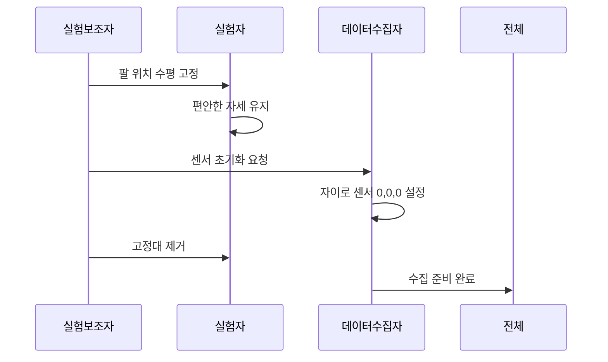

# SignGlove 실험 설계 및 데이터 수집 프로토콜

## 🧪 실험 개요

한국어 수어 34개 클래스에 대한 체계적인 데이터 수집을 위한 실험 설계 문서입니다. 3명 팀 구성으로 고품질 수어 데이터를 효율적으로 수집하는 것이 목표입니다.

## 👥 실험 팀 구성 (3명 필수)

| 역할 | 책임사항 | 주요 업무 |
|------|---------|----------|
| **실험자** | 수어 동작 수행 | • 정확한 수어 표현 (3-5초)<br/>• 자연스러운 동작 유지<br/>• 피로도 관리 |
| **실험보조자** | 환경 설정 관리 | • 팔 위치 수평 고정<br/>• 센서 0,0,0 초기화<br/>• 고정대 제거 타이밍 |
| **데이터 수집자** | 시스템 운영 | • 통합 수집기 실행<br/>• 실시간 품질 관리<br/>• 진행률 추적 |

## 🔄 실험 프로세스 상세

### 1. 사전 준비 (5분)
```
1️⃣ 하드웨어 점검
   - Arduino Nano 33 IoT 연결 확인
   - 플렉스 센서 5개 동작 테스트
   - USB 케이블 안정성 체크

2️⃣ 소프트웨어 준비  
   - `python server.py` 또는 통합 수집기 실행
   - 아두이노 연결 ('C' 키)
   - 진행률 확인 ('P' 키)

3️⃣ 환경 설정
   - 온도: 20-25°C 유지
   - 습도: 40-60% 권장  
   - 무선 간섭 최소화
```

### 2. 초기 자세 설정 (2분)


### 3. 데이터 수집 세션 (1-2시간)

#### 클래스별 수집 순서 (우선순위 기준)
```
🔥 1순위 (기본 자음): ㄱ ㄴ ㄷ ㄹ ㅁ  
   목표: 100개 에피소드/클래스

⭐ 2순위 (확장 자음 + 기본 모음): ㅂㅅㅇㅈㅊ + ㅏㅓㅗㅜㅡㅣ
   목표: 80개 에피소드/클래스

📝 3순위 (복합 모음 + 숫자): ㅋㅌㅍㅎ + ㅑㅕㅛㅠ + 0-9
   목표: 50-60개 에피소드/클래스
```

#### 에피소드별 수집 절차 (클래스당)
```
1. 'N' 키 → 클래스 선택 (1-34)
2. 실험자: 3-5초 자연스러운 수어 동작
3. 데이터수집자: 품질 모니터링 (Hz, 샘플 수)
4. 'M' 키 → 에피소드 종료
5. 결과 확인 → 재수집 여부 판단
6. 반복 (목표 개수까지)
```

## ⚠️ 핵심 유의사항

### 실험 중 필수 체크포인트

#### 🔍 품질 관리 (매 에피소드)
- **샘플링 레이트**: 20-100Hz 정상 범위
- **에피소드 길이**: 2-10초 권장 (3-5초 최적)
- **센서 범위**: 
  - 플렉스: 700-900 범위 (벗어나면 센서 교체)
  - 자이로: -180~180° 범위
  - 가속도: -2~2g 범위

#### 🔄 주기적 점검 (10개 에피소드마다)
- **센서 드리프트**: 자이로 센서 재초기화
- **플렉스 센서**: 안정성 확인 및 교체 판단
- **실험자 상태**: 피로도 체크 및 휴식 필요성

#### ⏰ 세션 관리
- **30분마다**: 5분 휴식
- **최대 연속**: 2시간 (긴 휴식 필요)
- **일일 권장**: 4-6시간 (여러 세션 분할)

### 🚨 문제 발생 시 대응

#### 하드웨어 문제
| 문제 | 증상 | 해결방법 |
|------|------|----------|
| 시리얼 연결 끊김 | 데이터 중단 | 'C' 키로 재연결 |
| 플렉스 센서 불량 | 비정상 값 (< 700 or > 900) | 센서 교체 |
| IMU 드리프트 | 각도 누적 오차 | 'recal' 명령어 실행 |

#### 소프트웨어 문제  
| 문제 | 증상 | 해결방법 |
|------|------|----------|
| 파싱 오류 | "데이터 파싱 오류" 메시지 | 아두이노 재시작 |
| 저장 실패 | H5 파일 생성 안됨 | 디스크 용량 확인 |
| 진행률 오류 | 부정확한 통계 | 'R' 키로 재계산 |

## 📊 실험 일정 계획

### 3-4주 수집 계획 (총 15-20 세션)

#### 1주차: 기본 자음 (5개)
- **ㄱㄴㄷㄹㅁ**: 각 100개 에피소드
- **예상 시간**: 5-6 세션 (1-2시간/세션)
- **총 에피소드**: 500개

#### 2주차: 확장 자음 + 기본 모음 (11개) 
- **ㅂㅅㅇㅈㅊ**: 각 80개 에피소드
- **ㅏㅓㅗㅜㅡㅣ**: 각 80개 에피소드  
- **예상 시간**: 6-8 세션
- **총 에피소드**: 880개

#### 3주차: 복합 모음 + 자음 마무리 (8개)
- **ㅋㅌㅍㅎ**: 각 60개 에피소드
- **ㅑㅕㅛㅠ**: 각 60개 에피소드
- **예상 시간**: 4-5 세션  
- **총 에피소드**: 480개

#### 4주차: 숫자 + 보완 수집 (10개)
- **0123456789**: 각 50개 에피소드
- **부족한 클래스 보완 수집**
- **예상 시간**: 3-4 세션
- **총 에피소드**: 500개 + α

### 총 목표 에피소드
```
전체 목표: 2,460개 에피소드
- 1순위: 500개 (ㄱㄴㄷㄹㅁ × 100)
- 2순위: 880개 (11클래스 × 80)  
- 3순위: 720개 (12클래스 × 60)
- 숫자: 500개 (10클래스 × 50)
- 보완: 360개 (예비)
```

## 📈 데이터 품질 기준

### 자동 검증 항목
- ✅ **타임스탬프**: 연속성 및 역행 없음
- ✅ **샘플링**: 20-100Hz 범위 유지
- ✅ **센서 범위**: 각 센서별 정상 범위
- ✅ **결측값**: NaN 또는 빈 값 없음
- ✅ **길이**: 2-10초 에피소드 길이

### 수동 검증 포인트
- 🔍 **동작 자연성**: 과도한 긴장이나 부자연스러운 동작 없음
- 🔍 **일관성**: 동일 클래스 내 동작 패턴 유사성
- 🔍 **명확성**: 다른 클래스와 구별 가능한 뚜렷한 특징

## 🔬 실험 환경 최적화

### 물리적 환경
```
온도: 20-25°C (센서 안정성)
습도: 40-60% (정전기 방지)  
조명: 자연광 또는 LED (작업 편의성)
소음: 최소화 (집중도 향상)
```

### 네트워크 환경
```
WiFi: 안정적 연결 (데이터 유실 방지)
간섭: 2.4GHz 기기 최소화
백업: 유선 연결 준비 (예비)
```

### 작업 공간
```
책상: 팔 받침 가능한 높이
의자: 편안한 자세 유지 가능
공간: 자유로운 손 움직임 보장
백업: 전원 및 데이터 저장소
```

---

**📝 이 실험 설계는 실제 수집 경험을 바탕으로 지속적으로 개선됩니다.**

**🔄 업데이트**: 채팅에서 실험 관련 논의 시 이 문서를 우선적으로 수정합니다.