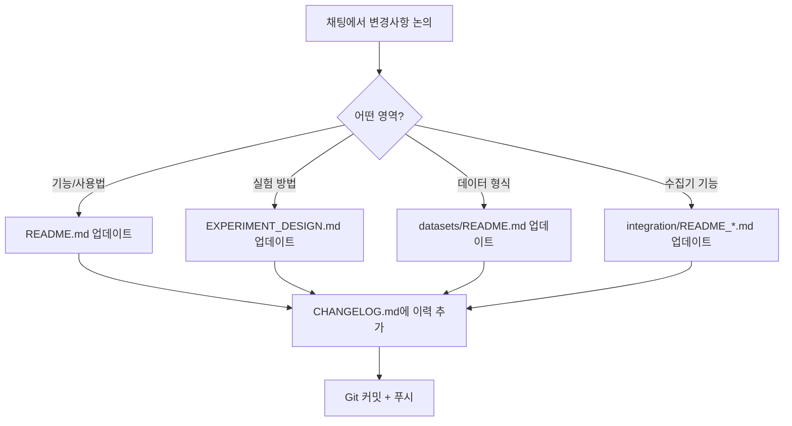

# 📚 SignGlove_HW 문서 관리 체계

## 🎯 관리 대상 MD 파일들

### 🔥 채팅 변경 시 즉시 업데이트 필요
이 파일들은 채팅에서 논의된 내용이나 수정사항이 생기면 **반드시 동기화**해야 합니다.

| 파일명 | 역할 | 업데이트 트리거 | 담당자 |
|--------|------|----------------|--------|
| **`README.md`** | 메인 프로젝트 소개 | 기능/사용법 변경 시 | @AI + @사용자 |
| **`CHANGELOG.md`** | 변경 이력 관리 | 모든 변경사항 발생 시 | @AI |
| **`EXPERIMENT_DESIGN.md`** | 실험 프로토콜 | 실험 방법론 변경 시 | @사용자 |
| **`integration/README_UNIFIED_COLLECTOR.md`** | 통합 수집기 가이드 | 수집기 기능 변경 시 | @AI |
| **`datasets/README.md`** | 데이터셋 구조 | 데이터 형식 변경 시 | @AI |

### 📋 참고용 (필요 시 업데이트)
| 파일명 | 역할 | 업데이트 빈도 |
|--------|------|--------------|
| **`DOCS_MANAGEMENT.md`** | 이 문서 (관리 규칙) | 문서 구조 변경 시 |
| **`.gitignore`** | Git 제외 규칙 | 파일 구조 변경 시 |

## 🔄 업데이트 워크플로우

### 1. 채팅에서 변경사항 발생 시


### 2. 업데이트 체크리스트
- [ ] 변경된 기능이 README.md에 반영되었는가?
- [ ] 실험 방법 변경이 EXPERIMENT_DESIGN.md에 업데이트되었는가?
- [ ] 새로운 데이터 형식이 datasets/README.md에 문서화되었는가?
- [ ] 변경 이력이 CHANGELOG.md에 기록되었는가?
- [ ] 관련 링크들이 여전히 유효한가?

## 📝 문서 작성 규칙

### Markdown 스타일 가이드
```markdown
# H1: 메인 제목 (파일당 1개)
## H2: 주요 섹션 
### H3: 하위 섹션
#### H4: 세부 항목

🎯 🔧 📊 ✨ 🤟 🧪 🚀 📁 📈 🔗 📚 ← 섹션별 이모지 사용
✅ ❌ ⚠️ 💡 📋 🔥 📝 ← 상태/강조 이모지
```

### 코드 블록 규칙
- **CSV 예시**: ```csv
- **Python 코드**: ```python  
- **Bash 명령**: ```bash
- **아두이노**: ```cpp
- **JSON**: ```json

### 링크 관리
- 내부 링크: `[파일명](파일경로)` 형식
- 섹션 링크: `[섹션명](#앵커)` 형식
- 외부 링크: 절대 경로 사용

## 🚨 긴급 업데이트 시나리오

### 실시간 수정이 필요한 경우
1. **하드웨어 변경** → README.md + EXPERIMENT_DESIGN.md
2. **펌웨어 업데이트** → README.md + 사용법 섹션
3. **데이터 형식 변경** → datasets/README.md + 모든 관련 문서
4. **실험 프로토콜 변경** → EXPERIMENT_DESIGN.md + README.md
5. **수집기 기능 추가** → integration/README_*.md + README.md

### 변경사항 전파 순서
```
1차: 해당 기능 문서 업데이트
2차: README.md 메인 섹션 반영  
3차: CHANGELOG.md 이력 추가
4차: 관련 링크 검증
5차: Git 커밋 메시지 작성
```

## 📊 문서 품질 관리

### 정기 점검 항목 (주 1회)
- [ ] 모든 내부 링크가 유효한가?
- [ ] 코드 예시가 최신 버전과 일치하는가?
- [ ] 파일 경로가 실제 구조와 맞는가?
- [ ] 이모지와 포맷이 일관성 있게 사용되었는가?
- [ ] 날짜와 버전 정보가 정확한가?

### 문서 일관성 체크
```bash
# 링크 검증
grep -r "](.*\.md)" *.md
# 코드 블록 체크  
grep -r "```" *.md | grep -v "```bash\|```python\|```csv\|```cpp\|```json"
# 날짜 형식 통일 확인
grep -r "202[0-9]" *.md
```

## 🔮 문서 발전 계획

### 단기 계획 (1주일)
- [ ] 모든 MD 파일 현재 상태 동기화
- [ ] 링크 일관성 확보
- [ ] 코드 예시 검증

### 중기 계획 (1개월)  
- [ ] 자동 문서 생성 스크립트 개발
- [ ] 문서 품질 CI/CD 파이프라인 구축
- [ ] 다국어 지원 (영어 번역)

### 장기 계획 (3개월)
- [ ] 웹 기반 문서 사이트 구축
- [ ] 대화형 튜토리얼 추가
- [ ] 비디오 가이드 제작

---

**📝 이 관리 체계는 프로젝트 진행에 따라 지속적으로 개선됩니다.**

**🤖 AI 지원**: 이 문서는 AI가 자동으로 업데이트하며, 사용자 피드백을 반영합니다.
