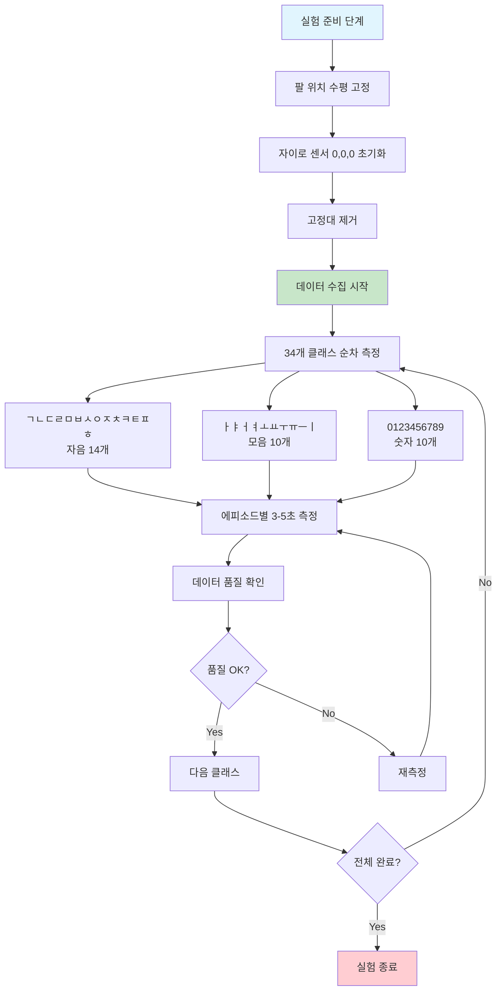
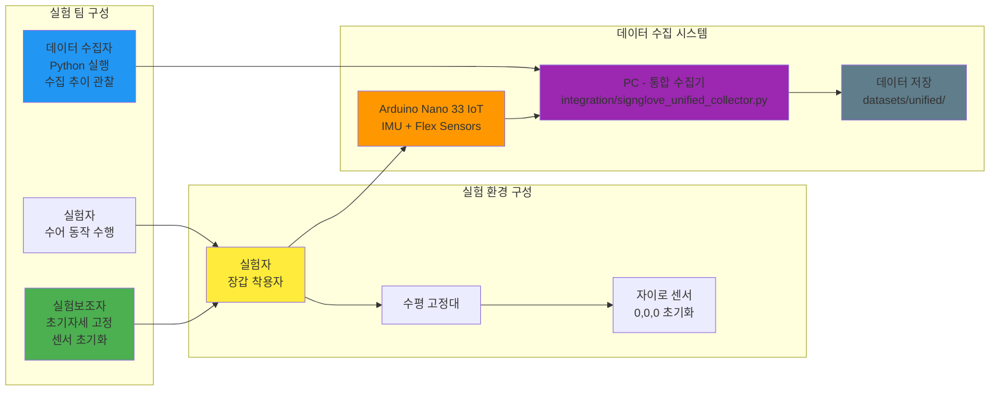

# SignGlove_HW
센서 기반 수화 통역 장갑 제작기

## 🎯 프로젝트 개요

한국어 수어 인식을 위한 하드웨어 센서 시스템입니다. Arduino Nano 33 IoT와 플렉스 센서를 활용하여 실시간 수어 데이터를 수집하고 ML 학습용 데이터셋을 구축합니다.

## 🔧 하드웨어 구성

- **Arduino Nano 33 IoT** (LSM6DS3 IMU 내장)
- **플렉스 센서 5개** (A0, A1, A2, A3, A6 핀)
- **USB 시리얼 통신** (115200 baud)

## 📊 최신 기능 (2025.01.26 업데이트)

> **🚀 v2.0 주요 변화**: Madgwick AHRS → 보완 필터, 9필드 → 12필드, WiFi → UART 중심

### ✨ 가속도 데이터 지원 추가
- **12필드 CSV 형식**: `timestamp,pitch,roll,yaw,accel_x,accel_y,accel_z,flex1,flex2,flex3,flex4,flex5`
- **IMU 6축 완전 활용**: 자이로스코프 + 가속도계
- **실시간 Hz 측정**: 아두이노 타임스탬프 기반 정확한 주기 계산

### 🧪 테스트 기준 수집기(server.py)
- 이 저장소의 최신 테스트 기준 코드는 `server.py` 입니다.
- 기본 입력 포맷은 UART 9필드입니다: `timestamp,pitch,roll,yaw,flex1,flex2,flex3,flex4,flex5`
- 가속도 3축(`accel_x, accel_y, accel_z`)은 통합 수집기(`integration/signglove_unified_collector.py`)에서 지원되며, `imu_flex_serial.ino`와 함께 사용할 때 12필드로 수집됩니다.
- 실행 방법: `python server.py`

### 🤟 통합 수어 데이터 수집기
- **34개 한국어 수어 클래스** 지원 (자음14 + 모음10 + 숫자10)
- **ROS2 스타일 키보드 인터페이스**
- **H5 형식 저장** (KLP-SignGlove 호환)
- **실시간 진행률 추적** 및 우선순위 기반 수집 가이드

> 참고: `server.py`는 단일 파일 기반의 간결한 테스트·수집기이며, `integration/signglove_unified_collector.py`는 H5 저장, 진행률 추적, 상세 키보드 UI 등 확장 기능을 제공합니다.

## 🧪 실험 설계 및 데이터 수집 프로토콜

### 실험 프로세스 흐름도



### 실험 팀 구성 및 시스템 구조



### 실험 설계 핵심 특징

#### 🎯 **3명 팀 구성**
- **실험자**: 정확한 수어 동작 수행 (3-5초 자연스러운 표현)
- **실험보조자**: 팔 고정, 센서 0,0,0 초기화, 고정대 제거
- **데이터 수집자**: 통합 수집기 운영, 실시간 품질 관리

#### 📊 **수집 목표**
- **총 클래스**: 34개 (자음 14 + 모음 10 + 숫자 10)
- **클래스당 에피소드**: 50-100개
- **총 예상 데이터**: 2,460개 에피소드
- **예상 소요 기간**: 3-4주 (15-20 세션)

#### ⚠️ **핵심 유의사항**
- **센서 드리프트**: 10개 에피소드마다 재초기화
- **플렉스 센서 안정성**: 700-900 범위 벗어나면 교체
- **실험자 피로도**: 30분마다 휴식, 최대 2시간 연속
- **환경 통제**: 온도 20-25°C, 습도 40-60%, 무선 간섭 최소화

#### 📋 **상세 프로토콜**
전체 실험 설계 및 유의사항은 [`EXPERIMENT_DESIGN.md`](EXPERIMENT_DESIGN.md)를 참조하세요.

## 🚀 사용법

### 1. 펌웨어 업로드
```bash
# Arduino IDE로 imu_flex_serial.ino 업로드
```

### 2. 데이터 수집 (모드 선택)

**기본 테스트/수집(server.py · 9필드, UART 기준):**
```bash
python server.py
```

**간단한 CSV 수집(csv_uart.py · 9필드, UART):**
```bash
python csv_uart.py
```

**통합 수집기 (권장 · 12필드, 가속도 포함):**
```bash
python integration/signglove_unified_collector.py
```

### 3. 통합 수집기 조작
```
C: 아두이노 연결
N: 새 에피소드 (클래스 선택 1-34)
M: 에피소드 종료
P: 진행 상황
Q: 종료
```

## 📁 파일 구조

```
SignGlove_HW/
├── 📱 imu_flex_serial.ino          # 아두이노 펌웨어 (가속도 지원)
├── 📊 csv_uart.py                  # 간단한 CSV 수집기
├── 📊 csv_wifi.py                  # WiFi 데이터 수집기 (레거시)  
├── 🗂️ datasets/                    # 데이터셋 저장소
│   ├── raw/                       # 원본 CSV
│   ├── processed/                 # 전처리된 데이터
│   ├── unified/                   # H5 에피소드 파일
│   └── ksl_34classes/            # 클래스별 정리
├── 🔧 integration/                 # 통합 시스템
│   ├── README_UNIFIED_COLLECTOR.md
│   └── signglove_unified_collector.py
└── 📋 README.md                   # 이 파일
```

## 🎯 34개 한국어 수어 클래스

| 카테고리 | 클래스 | 목표 |
|---------|--------|------|
| **자음** (14개) | ㄱㄴㄷㄹㅁㅂㅅㅇㅈㅊㅋㅌㅍㅎ | 80-100개/클래스 |
| **모음** (10개) | ㅏㅑㅓㅕㅗㅛㅜㅠㅡㅣ | 60-80개/클래스 |
| **숫자** (10개) | 0123456789 | 50개/클래스 |

## 📈 데이터 형식

### CSV 출력 (기준 9필드 · server.py)
```csv
timestamp(ms),pitch(°),roll(°),yaw(°),flex1,flex2,flex3,flex4,flex5
1234567890,10.5,-5.2,15.8,512,678,723,834,567
```

### CSV 출력 (확장 12필드 · 통합 수집기)
```csv
timestamp(ms),pitch(°),roll(°),yaw(°),accel_x(g),accel_y(g),accel_z(g),flex1,flex2,flex3,flex4,flex5
1234567890,10.5,-5.2,15.8,0.123,-0.045,0.987,512,678,723,834,567
```

### H5 저장 (KLP-SignGlove 호환)
```python
episode_20250126_153000_ㄱ.h5:
├── sensor_data        # [N,8] 메인 센서 (flex5 + orientation3)
├── timestamps         # [N] PC 수신 타임스탬프
├── arduino_timestamps # [N] 아두이노 타임스탬프  
├── sampling_rates     # [N] 실시간 Hz
└── sensors/
    ├── flex           # [N,5] 플렉스 센서
    ├── orientation    # [N,3] 자이로 오일러각
    └── acceleration   # [N,3] 가속도
```

## 🔗 통합 시스템 연동

### KLP-SignGlove 호환
- ✅ 동일한 8채널 센서 데이터 구조
- ✅ 562 FPS 실시간 추론 지원
- ✅ CNN+LSTM+Attention 모델 적용 가능

### SignGlove 메인 프로젝트 연동
- ✅ `SensorData` 모델 완벽 호환
- ✅ FastAPI 서버 직접 연결 가능
- ✅ 실시간 추론 + TTS 통합

## 🧪 기술적 고려사항

### 센서 설계 원칙
- 손의 위치에 무관한 측정 (상대적 움직임 기반)
- Z축 기준 측정으로 안정성 확보
- 개인차 변수 최소화 (팔 길이, 키 등 제외)

### 시스템 요구사항
- 실험 환경별 표준 설정 필요
- 자이로 센서 변수 통제 가능한 환경
- 일관된 데이터 품질 유지

### 측정/파싱 세부 규칙 및 주의사항
- **Hz 계산 기준**: 아두이노 `timestamp(ms)` 차분으로 계산합니다. 타임스탬프 역행/리셋 감지 시 해당 구간 Hz는 제외하거나 이동평균으로 완화하는 것을 권장합니다.
- **헤더 라인 처리**: `timestamp,`로 시작하는 헤더는 파싱에서 스킵해야 합니다. 라벨/주석(`#`) 라인도 무시합니다.
- **필드 호환성**: 9필드(UART 기준)와 12필드(가속도 포함)를 모두 허용하도록 최소 필드 이상(>= 요구 인덱스) 검증과 안전 파싱을 권장합니다.
- **단위 일관성(가속도)**: CSV 헤더는 g 단위(`accel_*(g)`)이며, 서버 스키마는 m/s²를 설명합니다. 학습·분석 시 g→m/s²(×9.80665) 변환 또는 메타에 단위 저장 후 전처리 변환을 권장합니다.
- **오일러각 vs 자이로**: 일부 수집기에서 `pitch/roll/yaw`(각도)가 `gyro_*` 필드로 저장될 수 있으니, 모델/전처리에서 필드 의미를 명확히 분리하세요(orientation vs gyroscope).
- **시리얼 디코딩**: `errors='ignore'` 사용 시 바이트 손실 가능성이 있으므로 라인 검증/오류 카운트 로깅을 권장합니다.
- **버퍼/라인 분리**: 대량 버스트·CRLF 혼재 환경에서는 수동 버퍼 누적 후 개행 분리 방식이 안전합니다(일부 클라이언트 코드 참조).
- **초기 Hz=0 처리**: 첫 샘플은 기준이 없어 Hz=0이 될 수 있습니다. 품질 지표 계산에서 초기 N샘플 제외 또는 스무딩하세요.
- **타임스탬프 선택**: 동기화·윈도우링은 아두이노 타임 기준을 사용하고, PC 수신 타임은 메타(수신 지연 추정)로만 사용하세요.

## 📊 성능 특징

- **실시간 Hz 측정**: 아두이노 타임스탬프 기준
- **논블로킹 수집**: 큐 기반 데이터 처리
- **메모리 효율성**: 스트리밍 방식 저장
- **안정성**: 연결 끊김 자동 감지/복구

## 🔮 향후 계획

- [ ] 실시간 모델 학습 파이프라인
- [ ] 웹 기반 수집 인터페이스  
- [ ] 다중 사용자 수집 시스템
- [ ] 자동 데이터 품질 평가
- [ ] 클라우드 저장소 연동

## 📚 관련 문서

### 📖 주요 문서 (채팅 변경시 자동 업데이트)
- [`integration/README_UNIFIED_COLLECTOR.md`](integration/README_UNIFIED_COLLECTOR.md) - 통합 수집기 상세 가이드
- [`datasets/README.md`](datasets/README.md) - 데이터셋 구조 및 활용법  
- [`EXPERIMENT_DESIGN.md`](EXPERIMENT_DESIGN.md) - 실험 설계 및 데이터 수집 프로토콜

### 📋 관리 문서
- [`CHANGELOG.md`](CHANGELOG.md) - 버전별 변경 이력 및 이전 vs 현재 비교
- [`DOCS_MANAGEMENT.md`](DOCS_MANAGEMENT.md) - 문서 관리 체계 및 업데이트 규칙

---

**🤟 SignGlove Project - Making Sign Language Accessible Through Technology**
